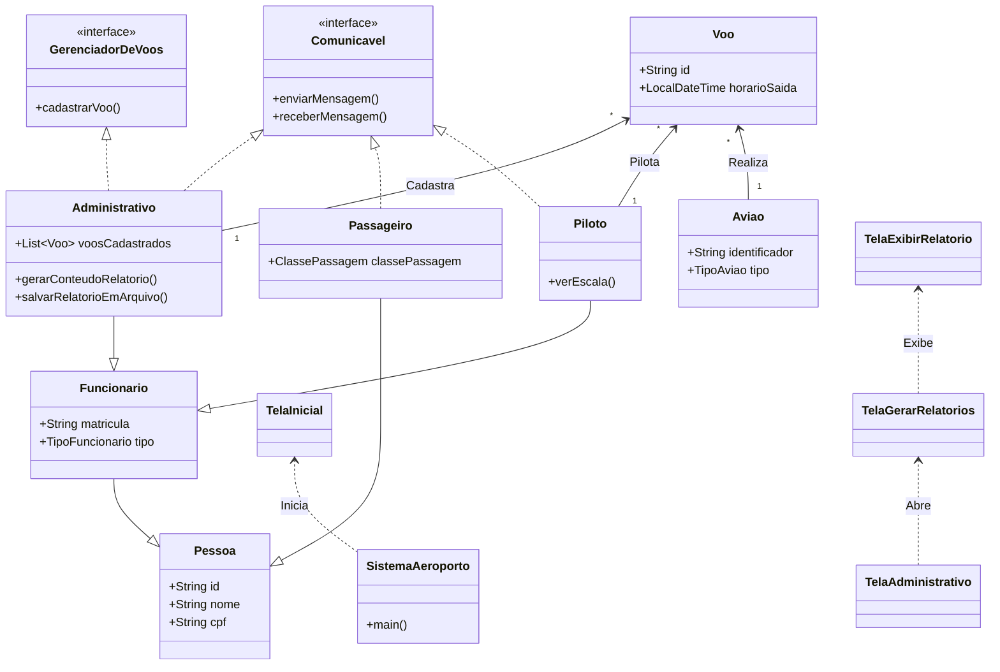

# Sistema de Gerenciamento de Aeroporto

Este projeto é um sistema para gerenciamento de um aeroporto, desenvolvido em Java com a biblioteca Swing para a interface gráfica. Ele permite a interação de diferentes tipos de usuários, como passageiros e funcionários (administrativos e pilotos), cada um com suas respectivas funcionalidades.

## Funcionalidades Principais

  * **Autenticação de Usuários**: Telas de login separadas para passageiros e funcionários.
  * **Painel do Passageiro**:
      * Consultar voos disponíveis.
      * Reservar poltronas em voos.
      * Enviar dúvidas para a equipe administrativa através de um chat.
  * **Painel do Piloto**:
      * Visualizar a escala de voos agendados.
      * Escolher lanches para seus próximos voos.
      * Consultar suas informações pessoais.
  * **Painel Administrativo**:
      * Cadastrar novos voos, alocando aviões e pilotos.
      * Gerar relatórios detalhados sobre os voos cadastrados.
      * Responder a dúvidas de passageiros através de um chat centralizado.
  * **Persistência de Dados**: O sistema utiliza arquivos `.csv` e `.txt` na pasta `dados/` para armazenar informações sobre voos, funcionários, passageiros, reservas e lanches, garantindo que os dados persistam entre as execuções.

## Como Executar o Projeto

1.  **Pré-requisitos**:

      * JDK (Java Development Kit) instalado.
      * Uma IDE Java como Eclipse, IntelliJ IDEA ou VS Code (com as extensões para Java).

2.  **Execução**:

      * Importe o projeto para a sua IDE.
      * Localize o arquivo `sistema/SistemaAeroporto.java`.
      * Execute o método `main` contido neste arquivo para iniciar o sistema. A tela principal (`TelaInicial`) será exibida.

## Arquitetura e Diagrama de Classes

O sistema é organizado em pacotes que separam as responsabilidades:

  * **`pessoas`**: Contém as classes que modelam os usuários do sistema (`Pessoa`, `Funcionario`, `Administrativo`, `Piloto`, `Passageiro`).
  * **`aviao`**: Modela os conceitos de `Aviao` e `Voo`.
  * **`enums`**: Agrupa todos os tipos enumerados, como `Destino` e `TipoFuncionario`.
  * **`comunicacao`**: Gerencia a troca de mensagens e o registro de usuários através da `CentralComunicacao`.
  * **`visual`**: Contém todas as janelas (classes `JFrame`) que compõem a interface gráfica.
  * **`sistema`**: Ponto de entrada da aplicação, responsável por carregar os dados iniciais.

### Diagrama de Classes

### Explicação do Diagrama:

  * **Herança**: As classes `Funcionario` e `Passageiro` herdam da classe base `Pessoa`. Por sua vez, `Piloto`, `Administrativo` e `Comissario` herdam de `Funcionario`.
  * **Interfaces**: A interface `Comunicavel` é implementada por classes que podem interagir no chat, como `Passageiro` e `Administrativo`. A interface `GerenciadorDeVoos` define o contrato para cadastrar voos, implementado por `Administrativo`.
  * **Associação**: Existe uma forte associação entre as classes de `visual` (as telas) e as classes de `pessoas` (os dados dos usuários). Por exemplo, a `TelaAdministrativo` precisa de um objeto `Administrativo` para funcionar.
  * **Composição**: Um `Voo` é composto por um `Aviao` e um `Piloto`, indicando que um voo não existe sem eles.

## Testes de Funcionalidades

Para testar as diferentes funcionalidades do sistema, utilize os dados de login fornecidos nos arquivos localizados na pasta `dados/`.

  * **Para Passageiros**: Utilize os dados do arquivo `passageiros.csv`. O login é feito com o **CPF** e a **senha** correspondentes.
  * **Para Funcionários (Pilotos e Administrativos)**: Utilize os dados do arquivo `funcionarios.csv`. O login é feito com a **matrícula** e a **senha** correspondentes.

Com esses dados, você poderá acessar os diferentes painéis e testar todas as funcionalidades implementadas para cada tipo de usuário.